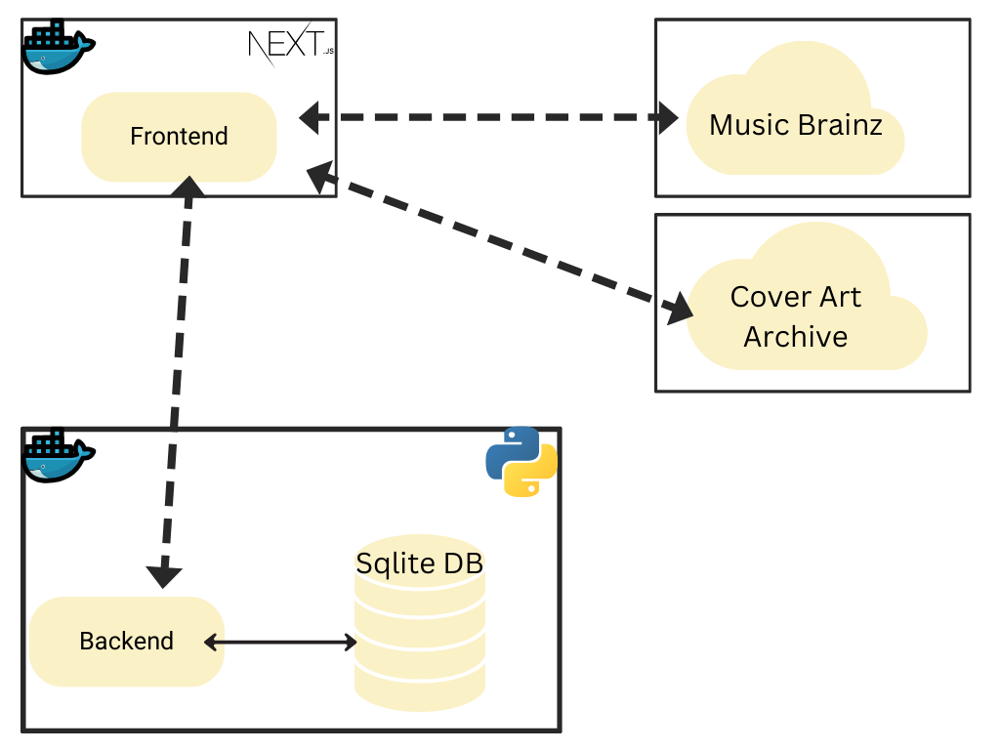

# Projeto MPV em Arquitetura de Software (Songboxd)

Este é o frontend do MVP em Arquitetura de Software para a pós-graduação em engenharia de software da PUC-RJ desenvolvido com Next.js. A aplicação consome uma API própria de persistência hospedada [aqui](https://github.com/pedro-git-projects/puc-mvp-software-architecture-persistence) e as APIs públicas e gratuitas [Music Brainz](https://musicbrainz.org/doc/MusicBrainz_API) e [Cover Art Archive](https://musicbrainz.org/doc/Cover_Art_Archive/API).

## Tabela de Conteúdos

1. [Pré-requisitos](#pré-requisitos)
2. [Estrutura do Projeto](#estrutura-do-projeto)
3. [Configuração](#configuração)
4. [Desenvolvimento](#desenvolvimento)
5. [Dockerfile](#dockerfile)
6. [docker-compose.yml](#docker-composeyml)
7. [Critérios Avaliativos](#critérios-avaliativos)

## Pré-requisitos

Antes de começar, você precisará ter as seguintes ferramentas instaladas em sua máquina:

- [Docker](https://www.docker.com/get-started)
- [Docker Compose](https://docs.docker.com/compose/install/)

## Estrutura do Projeto

- `Dockerfile`: Define a imagem Docker para a aplicação.
- `docker-compose.yml`: Define os serviços Docker para desenvolvimento.
- `docker-compose.prod.yml`: Define os serviços Docker para produção.
- `.dockerignore`: Arquivos e diretórios a serem ignorados pelo Docker.

## Configuração

1. Clone o repositório:

   ```bash
   git clone https://github.com/pedro-git-projects/puc-mvp-software-architecture-frontend.git
   cd puc-mvp-software-architecture-frontend
   ```

## Desenvolvimento

Para rodar a aplicação em modo de desenvolvimento, use o Docker Compose:

1. Construa a imagem Docker:

   ```bash
   docker-compose build
   ```

2. Inicie a aplicação:

   ```bash
   docker-compose up
   ```

A aplicação estará disponível em [http://localhost:3000](http://localhost:3000).

Lembre-se de ter subido também a outra API que faz parte do projeto, hospedada [aqui](https://github.com/pedro-git-projects/puc-mvp-software-architecture-persistence)

## Dockerfile

O `Dockerfile` utilizado para a construção da imagem Docker:

```Dockerfile
# Stage 1: Base
FROM node:22-alpine AS base
WORKDIR /app
COPY package*.json ./
RUN npm install
COPY . .

# Stage 2: Build
FROM base AS build
RUN npm run build

# Stage 3: Production
FROM node:18-alpine AS production
WORKDIR /app
COPY --from=build /app ./
EXPOSE 3000
CMD ["npm", "start"]

# Stage 4: Development
FROM base AS development
WORKDIR /app
EXPOSE 3000
CMD ["npm", "run", "dev"]
```

## docker-compose.yml

Arquivo `docker-compose.yml` para desenvolvimento:

```yaml
services:
  nextjs-app:
    build:
      context: .
      dockerfile: Dockerfile
    ports:
      - '3000:3000'
    volumes:
      - .:/app
      - /app/node_modules
    environment:
      NODE_ENV: development
    command: ["npm", "run", "dev"]
```

## Critérios Avaliativos

- "A interface do usuário deve fazer chamadas a pelo menos 5 rotas diferentes."


| Rota                                                                                                    | Componente            | Serviço                   | Método | Propósito                                                                                               |
|---------------------------------------------------------------------------------------------------------|-----------------------|---------------------------|--------|---------------------------------------------------------------------------------------------------------|
| `https://musicbrainz.org/ws/2/release?query=artist:${artist}%20AND%20release:${album}&fmt=json`         | `AlbumSearch`         | MusicBrainz               | GET    | Buscar informações de álbuns de um artista específico. No caso é utilizada para pegar o ID que pode ser usado para buscar a arte do álbum em uma segunda API.                                     |
| `https://coverartarchive.org/release/${releaseId}/front`                                                | `AlbumCover`          | Cover Art Archive         | GET    | Obter a url da imagem da capa de um lançamento específico.                                                      |
| `https://musicbrainz.org/ws/2/release?query=artist:${query.artist}%20AND%20release:${query.album}&fmt=json` | `SearchResults`       | MusicBrainz               | GET    | Buscar informações de álbuns de um artista específico com base em uma consulta do usuário. |
| `http://localhost:8000/token`                                                                           | `AuthProvider`        | Servidor desenvolvido por mim | POST   | Obter o token de autenticação para login do usuário.                                                     |
| `http://localhost:8000/users/`                                                                          | `SignupForm`         | Servidor desenvolvido por mim | POST    | Criar um novo usuário.                                                             |
| `http://localhost:8000/users/me`                                                                        | `Profile`             | Servidor desenvolvido por mim | DELETE | Deletar a conta do usuário logado.                                                            |
| `http://localhost:8000/users/me/`                                                                       | `Profile`             | Servidor desenvolvido por mim | GET    | Obter o perfil do usuário logado.                                                             |
| `/api/search?album=${album}`                                                                            | `SearchInput`         | Next.js Server Action     | GET    | Buscar informações de álbuns de um artista específico com base no nome do álbum fornecido pelo usuário.                                                             |

- "Será permitido a utilização de bibliotecas ou frameworks baseadas em Javascript, como o React, Next, e outras; Será permitido também o uso de bibliotecas de componentes, como o Material UI, Bootstrap, e outras" 

A aplicação é desenvolvida com NextJS 14 e Tailwind.

- "É fortemente recomendado produzir uma imagem (fluxograma) ilustrando a arquitetura da aplicação desenvolvida."


